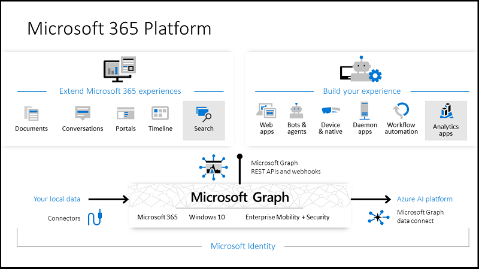

# Graph service.

## Microsoft Graph REST API

Microsoft Graph is the gateway to data and intelligence in Microsoft 365. It provides a unified programmability model that you can use to access the tremendous amount of data in Microsoft 365, Windows 10, and Enterprise Mobility + Security. Use the wealth of data in Microsoft Graph to build apps for organizations and consumers that interact with millions of users.

Powering the Microsoft 365 platform

 

In the Microsoft 365 platform, three main components facilitate the access and flow of data:

* The Microsoft Graph API offers a single endpoint, https://graph.microsoft.com, to provide access to rich, people-centric data and insights exposed as resources of Microsoft 365 services. You can use REST APIs or SDKs to access the endpoint and build apps that support scenarios spanning across productivity, collaboration, education, people and workplace intelligence, and much more. Microsoft Graph also includes a powerful set of services that manage user and device identity, access, compliance, security, and help protect organizations from data leakage or loss.
* Microsoft Graph connectors (preview) work in the incoming direction, delivering data external to the Microsoft cloud into Microsoft Graph services and applications, to enhance Microsoft 365 experiences such as Microsoft Search.
* Microsoft Graph data connect provides a set of tools to streamline secure and scalable delivery of Microsoft Graph data to popular Azure data stores. This cached data serves as data sources for Azure development tools that you can use to build intelligent applications.


## Microsoft Graph REST java client-library.

Fortunately Microsoft Graph provides a sdk/libraries for many languages. One of those is wirtten for java. You can find the corresponding java [library here](https://developer.microsoft.com/en-us/graph/get-started/java). In our case because we use [Apache Maven]() we retrieve the library through maven repositories. To do so we just define a depentancy on our [`POM`](pom.xml) xml. 

```xml
        <!-- Graph Library -->
        <dependency>
            <groupId>com.microsoft.graph</groupId>
            <artifactId>microsoft-graph</artifactId>
            <version>1.5.0</version>
        </dependency>
```

> Unfortunately not all the functionalities of the Microsoft Graph REST API can be implemented through this Library. Therefore, we have made some custom calls using `HttpURLConnection` which is provided by java core. You can find the implementation of the custom Graph hundler on the class `Graph_Handler`. 

## Service usage

As you can imagine we use this service in order to interact with Microsoft Graph. Every service that is registered on the Microservice ecosystem can implement a client of this service and therefore interact with Microsoft Graph. The service is registered to eurika with the name `GRAPH-SERVICE` so the corresponding Feign client shoud point at that name. A quick excample of a client implementation such as this is :

```java
/**
 *
 * @author Georgios Fiotakis
 */
@FeignClient(name = "graph-service", configuration = FeignConfiguration.class, fallbackFactory = GraphFallBackFactory.class)
public interface GraphImplService {

    String endpointPrefix = "/graph";

    @PostMapping(value = endpointPrefix + "/me", consumes = "application/json", produces = "application/json")
    public ResponseEntity<?> userInfo(@RequestBody UserToken tokenDetails);

    @PostMapping(value = endpointPrefix + "/me/teams", consumes = "application/json", produces = "application/json")
    public ResponseEntity<?> list_user_teams(@RequestBody UserToken tokenDetails);

    @PostMapping(value = endpointPrefix + "/team/{uuid}/users", consumes = "application/json", produces = "application/json")
    public ResponseEntity<?> list_team_members_resource(@PathVariable UUID uuid, @RequestBody UserToken tokenDetails);

    @PostMapping(value = endpointPrefix + "/team/{uuid}/sites", consumes = "application/json", produces = "application/json")
    public ResponseEntity<?> listTeamsSitesByTeamId(@PathVariable UUID uuid, @RequestBody UserToken tokenDetails);

}
```

> As you can see to make a call you need to implement at least the `UserToken` model on it. Thus because as we explained there is no actual user database instead we use the Microsoft Token of each registered user. Remember that if the user has already register and has an active self-signed-token this Microsoft Graph token will be available internaly through the headders of each request. You can retrieve the token from the request Headders like this :
```java
 @PostMapping(value = "/me-validate", consumes = "application/json", produces = "application/json")
    public ResponseEntity<?> userInfo(HttpServletRequest req, HttpServletResponse res) {
        log.info("Requesting user information based on token");
        return ResponseEntity.ok(
                user.getSignedUserInfo(new UserToken(req.getHeader("graph-token")))
        );
    }

```
With the appropriate `FallbackFactory` ofc :

```java

/**
 *
 * @author Georgios Fiotakis
 */
@Slf4j
@Component
public class GraphFallBackFactory implements FallbackFactory<GraphImplService> {

    @Override
    public GraphImplService create(Throwable thrwbl) {
        String httpStatus = thrwbl instanceof FeignException ? Integer.toString(((FeignException) thrwbl).status()) : "";

        return new GraphImplService() {
            @Override
            public ResponseEntity<?> userInfo(UserToken tokenDetails) {
                throw new UnsupportedOperationException("Not supported yet."); //To change body of generated methods, choose Tools | Templates.
            }

            @Override
            public ResponseEntity<?> list_user_teams(UserToken tokenDetails) {
                throw new UnsupportedOperationException("Not supported yet."); //To change body of generated methods, choose Tools | Templates.
            }

            @Override
            public ResponseEntity<?> list_team_members_resource(UUID uuid, UserToken tokenDetails) {
                throw new UnsupportedOperationException("Not supported yet."); //To change body of generated methods, choose Tools | Templates.
            }

            @Override
            public ResponseEntity<?> listTeamsSitesByTeamId(UUID uuid, UserToken tokenDetails) {
                throw new UnsupportedOperationException("Not supported yet."); //To change body of generated methods, choose Tools | Templates.
            }
        };
    }

}
```


Then you can simply use the `FeignClient` by `Autowiring` the interface to any Class that is defined as `Spring Bean`.

```java
    @Autowired
    private GraphRepo graphRepo;
```

Finally the `UserToken` model in json representation looks like this :

```json
{
    "userToken": "Microsoft Graph token"
}
```


## Endpoint table

URL-Prefix | endpoint| external-url (proxy) | Method | Model | Description 
------------ | ------------- | ------- | ---------- | ------------ |------------------ 
`/graph` | `/me-validate` | `https://3djuumpinfinite.teams.akka.eu/zuul/graph-service/graph/me-validate`| POST  | - | This endpoint simply returns the user information based on teh provided Graph token. Watch out you must not post the token, the system retreves it from the database if you have a self-signed one that is not expired.
`/graph` | `/me` | `https://3djuumpinfinite.teams.akka.eu/zuul/graph-service/graph/me`| POST  | `UserToken` | This endpoint simply returns the user information based on teh provided Graph token. Watch out you must post the token in this case.
`/graph` | `/user/{userPrincipal}` | `https://3djuumpinfinite.teams.akka.eu/zuul/graph-service/graph/user/{userPrincipal}`| POST  | `UserToken` | This endpoint simply returns the user information based on the id or the principa you provide. Watch out you must post the token in this case.
`/graph` | `/me/teams` | `https://3djuumpinfinite.teams.akka.eu/zuul/graph-service/graph/me/teams`| POST  | `UserToken` | This endpoint simply returns the Microsoft Teams that the user is part of. Watch out you must post the token in this case.
`/graph` | `/team/{uuid}/users` | `https://3djuumpinfinite.teams.akka.eu/zuul/graph-service/graph/team/{uuid}/users`| POST  | `UserToken` | This endpoint simply returns a list of users that belong to the given Microsoft Team. Watch out you must post the token in this case.
`/graph` | `/team/{uuid}/sites` | `https://3djuumpinfinite.teams.akka.eu/zuul/graph-service/graph/team/{uuid}/sites`| POST  | `UserToken` | This endpoint simply returns a list of SharePoint Sites that belong to the given Microsoft Team. Watch out you must post the token in this case.
`/graph` | `/team/{uuid}/user/{userId}` | `https://3djuumpinfinite.teams.akka.eu/zuul/graph-service/graphteam/{uuid}/user/{userId}`| POST  | `UserToken` | This endpoint simply adds a user to the given Microsoft Team. Watch out you must post the token in this case.
`/graph` | `/team/{uuid}/user/{userId}` | `https://3djuumpinfinite.teams.akka.eu/zuul/graph-service/graphteam/{uuid}/user/{userId}`| DELETE  | `UserToken` | This endpoint simply deletes a user to the given Microsoft Team. Watch out you must post the token in this case.


## Author & Licence

Original Author         :   [George Fiotakis](https://www.linkedin.com/in/george-fiotakis-320967159/). <br>
Contact Information     :   georgios.FIOTAKIS@akka.eu <br>
Contact Information     :   g.fiotakis@hotmail.com <br>

*This document and it's sub components & documents are Confidential INFORMATION which belongs to the group of AKKA Technologies & REAL FUSIO. Any
attempt of replication and distribution of this document without AKKA Technology's and REAL FUSIO's consent, will be persecuted legally.*

